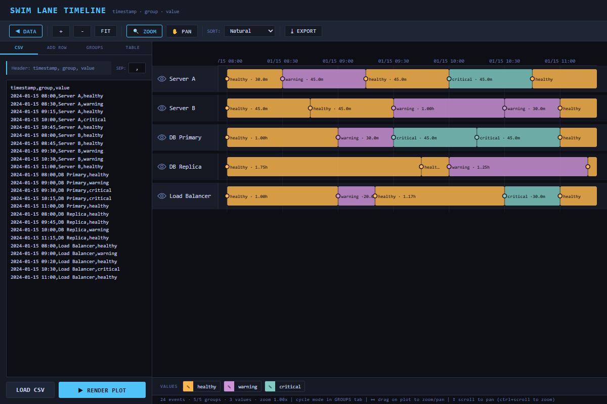

# Swimlane App
An interactive web application for visualizing event data on a swimlane timeline, built with React and Vite.

## Features

- **CSV Data Import**: Upload or paste CSV data containing `timestamp`, `group`, and `value` columns.
- **Interactive Timeline**: Zoom and pan across the timeline using your mouse or trackpad to explore events in detail.
- **Grouping & Sorting**: Data is organized into horizontal groups (lanes). Drag and drop groups to reorder them, or sort by name or event count.
- **Multi-mode Visualization**: Toggle group display modes between spans (durations), diamonds (instant events), and vertical lines.
- **Data Table**: View, filter, and star specific events in a detailed tabular format.
- **Export to HTML**: Export the entire interactive plot as a standalone, self-contained HTML file for easy sharing.
- **Custom Colors**: The app automatically assigns colors to different values, which can be customized via a built-in color picker.

## How to Use

1. **Load Data**: Open the "DATA" panel and paste your CSV data, or click "LOAD CSV" to upload a file. The dataset must include `timestamp`, `group`, and `value` headers.
2. **Render**: Click "RENDER PLOT" to generate the timeline visualization.
3. **Navigate**: Use your mouse wheel to pan horizontally. Hold `Ctrl` or `Cmd` while scrolling to zoom in and out. Alternatively, use the toolbar buttons (ZOOM, PAN, FIT) to navigate.
4. **Customize**: 
   - Go to the "GROUPS" tab to show/hide specific lanes or click the right side of a group to cycle its visualization style (span/diamond/line).
   - Use the "ADD ROW" tab to manually insert new data points.
   - Click on the color swatches in the legend or table to pick custom colors for specific values.
5. **Export**: Click the "EXPORT" button in the top toolbar to save your current timeline and data as an interactive HTML file that can be opened in any browser.
